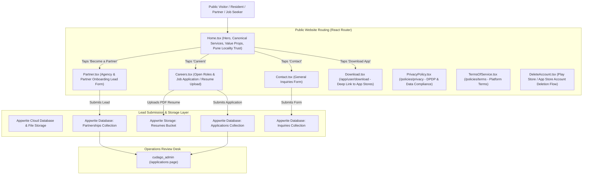

# Cudago Landing Portal Architecture & Sitemap

Website routing, lead funnels, and compliance policies for the **Cudago Public Landing Portal** (React 19, Vite 6, TypeScript, Tailwind CSS v4, Motion, Appwrite SDK).

---

## 1. Website Sitemap & User Conversion Funnel

---

## 2. Key Pages & Compliance Policies

1. **Brand Hero & Service Showcase ([`Home.tsx`](../src/Home.tsx)):**
   * Highlights the 9 canonical home service categories (Cleaning, Cooking, Babysitting, Elderly Care, Laundry, House Caretaker, Beauty & Grooming, Personal Training, Tutoring).
   * Contextual messaging for Pune gated societies (Amanora, Magarpatta, Viman Nagar, Kharadi, Kothrud).
2. **Partner Onboarding ([`Partner.tsx`](../src/pages/Partner.tsx)):**
   * Lead capture portal for domestic manpower agencies and service contractors to partner with Cudago.
3. **Careers & Resume Submissions ([`Careers.tsx`](../src/company/Careers.tsx) & [`Apply.tsx`](../src/pages/Apply.tsx)):**
   * Lists open engineering and operations roles with direct PDF resume upload to Appwrite Storage.
4. **App Download Deep Links ([`Download.tsx`](../src/pages/app/user/Download.tsx)):**
   * Smart deep link redirecting users to the Google Play Store or Apple App Store based on device user-agent.
5. **Legal & Compliance Policies ([`PrivacyPolicy.tsx`](../src/policies/PrivacyPolicy.tsx) & [`TermsOfService.tsx`](../src/policies/TermsOfService.tsx)):**
   * Indian Digital Personal Data Protection (DPDP) compliant privacy policy, terms of service, and user account deletion instructions required by app store submission guidelines.
